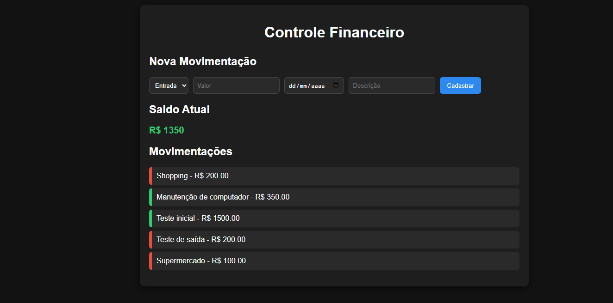

# Sistema de Controle Financeiro


Projeto desenvolvido por sprints utilizando Flask e MySQL.
# 💰 Sistema de Controle Financeiro

Sistema web simples para controle financeiro pessoal, permitindo registrar entradas e saídas, visualizar movimentações e acompanhar o saldo atual.

Este projeto foi desenvolvido como parte de um trabalho acadêmico utilizando backend em Python e Flask, banco de dados MySQL e uma interface web simples em HTML, CSS e JavaScript.

## 📷 Preview do sistema



---

# 🚀 Tecnologias utilizadas

**Backend**
- Python
- Flask
- MySQL

**Frontend**
- HTML
- CSS
- JavaScript

**Outros**
- Git
- GitHub

---

# 📊 Funcionalidades

✔ Cadastro de movimentações financeiras (entrada e saída)  
✔ Listagem de movimentações registradas  
✔ Cálculo automático do saldo  
✔ Interface web simples para interação com o sistema  
✔ Destaque visual para entradas e saídas  

---

# 📁 Estrutura do projeto

```
controle-financeiro
│
├── backend
│   ├── app.py
│   ├── db.py
│   └── requirements.txt
│
├── frontend
│   ├── index.html
│   └── style.css
│
├── database
│   └── schema.sql
│
├── .env.example
└── README.md
```

---

# ⚙️ Como executar o projeto

### 1️⃣ Clonar o repositório

```bash
git clone https://github.com/seu-usuario/controle-financeiro.git
```

---

### 2️⃣ Criar ambiente virtual

```bash
python -m venv venv
```

Ativar ambiente virtual:

**Windows**
```bash
venv\Scripts\activate
```

**Linux / Mac**
```bash
source venv/bin/activate
```

---

### 3️⃣ Instalar dependências

```bash
pip install -r backend/requirements.txt
```

---

### 4️⃣ Configurar banco de dados

Criar o banco no MySQL:

```sql
CREATE DATABASE controle_financeiro;
```

Executar o script:

```
database/schema.sql
```

---

### 5️⃣ Configurar variáveis de ambiente

Criar arquivo `.env` na raiz do projeto:

```
DB_HOST=localhost
DB_USER=root
DB_PASSWORD=sua_senha
DB_NAME=controle_financeiro
```

---

### 6️⃣ Executar backend

```bash
python backend/app.py
```

---

### 7️⃣ Executar frontend

Dentro da pasta `frontend`:

```bash
python -m http.server 5500
```

Abrir no navegador:

```
http://127.0.0.1:5500
```

---

# 📌 Status do projeto

Sprint 1 concluída ✔

Funcionalidades implementadas:
- Cadastro de movimentações
- Listagem de movimentações
- Cálculo de saldo
- Interface web funcional

---

# 👨‍💻 Autor

Desenvolvido por **Marcello Iorio**
