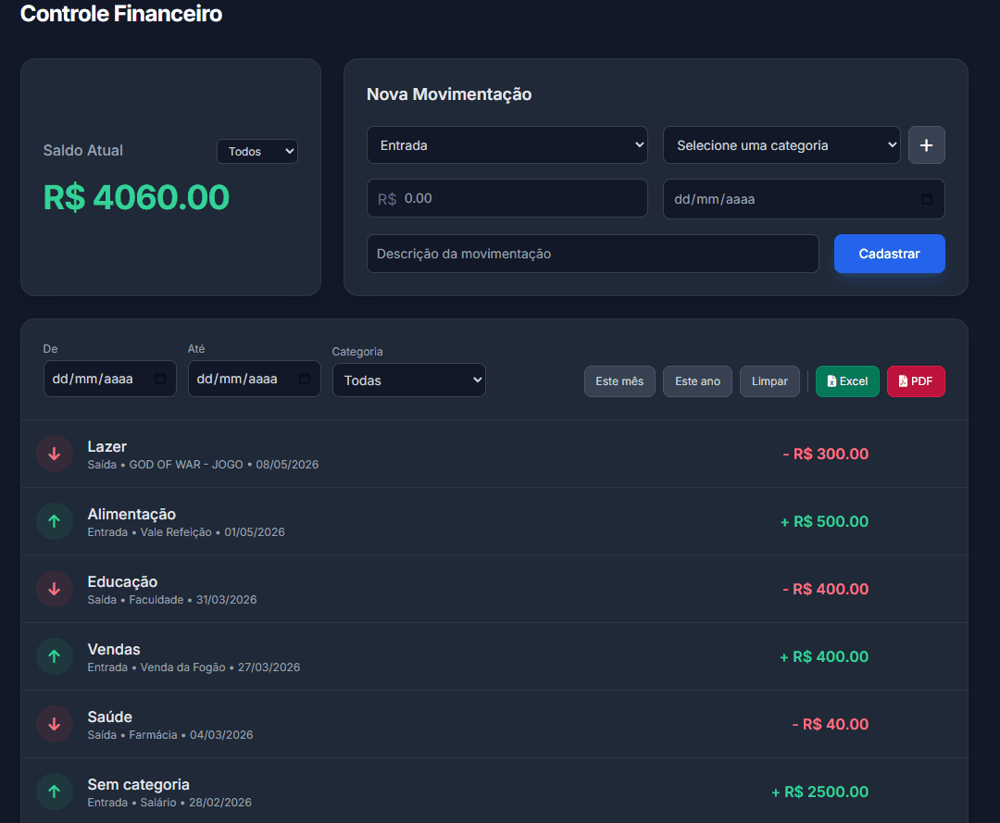

# 💰 Sistema de Controle Financeiro


Sistema web para controle financeiro pessoal, permitindo registrar entradas e saídas, organizar movimentações por categorias e acompanhar o saldo em tempo real.

Projeto desenvolvido por sprints utilizando Python (Flask), MySQL e uma interface web com HTML, CSS e JavaScript.

---

## 🎥 Demonstração



---

## 🚀 Tecnologias utilizadas

**Backend**
- Python
- Flask
- MySQL

**Frontend**
- HTML
- CSS
- JavaScript
- Tailwind

---

## 📊 Funcionalidades

✔ Cadastro de movimentações (entrada e saída)  
✔ Listagem de movimentações  
✔ Cálculo automático do saldo  
✔ Sistema de categorias  
✔ Criação de categorias pelo frontend  
✔ Edição de movimentações  
✔ Filtro por tipo (entrada/saída)  
✔ Feedback visual com notificações (toast)  
✔ Filtro de data e categoria  
✔ Relatórios em pdf e excel  
✔ Exclusão de movimentações  

---

## 📁 Estrutura do projeto

```
controle-financeiro/
├── backend/
├── frontend/
├── database/
├── .env.example
└── README.md
```

---

## ⚙️ Como executar o projeto

```bash
git clone https://github.com/marcello-iorio/controle-financeiro.git
cd controle-financeiro
python -m venv venv
venv\Scripts\activate
pip install -r backend/requirements.txt
python backend/app.py
```

Frontend:

```bash
cd frontend
python -m http.server 5500
```

Acesse no navegador:

```
http://127.0.0.1:5500
```

---

## 🗄️ Configuração do banco de dados

Criar banco no MySQL:

```sql
CREATE DATABASE controle_financeiro;
```

Executar o script:

```
database/schema.sql
```

Criar arquivo `.env` na raiz:

```
DB_HOST=localhost
DB_USER=root
DB_PASSWORD=sua_senha
DB_NAME=controle_financeiro
```

---

## 📌 Status do projeto

- Sprint 1 ✔ (movimentações e saldo)  
- Sprint 2 ✔ (categorias e filtro de entrada e saída)  
- Sprint 3 ✔ (relatório pdf/excel, filtros de data e categoria e exclusão de movimentações )
- Sprint 4 ✔ (visualização de dashboard financeiro (saldos consolidados e despesas por categoria))

---

## 👤 Autor

Marcello Iorio